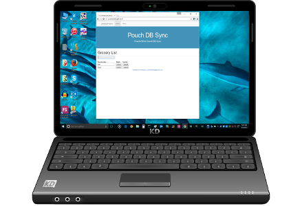
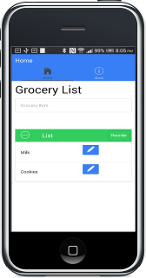
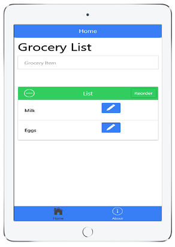

<h1>Grocery List (Pouch Sync) App</h1>

   
    

      
      &nbsp;&nbsp;&nbsp;
      
    

   

<h3>Sync Pouch DB local storage DB to Couch DB remote database for 6-way data binding</h3>

<h2>Problems</h2>
<h4>
  <ol>
    <li>Without a database, your data is not persistent</li>
    <li>If you store data in remote database to get persistance; but you can't do anything if the network
      goes down.
    </li>
    <li>If you store the data in local storage, to get persistance, and can work without a network; but
      you have multiple copies of your database on each browser, on each computer, or device which
      accesses the data
    </li>
  </ol>
</h4>
  <h2>Solution</h2>
  <h4>
  <ol>
    <li>Pouch DB allows you to organize and store your data in local storage for persistance, and the
      ability to work offline, on devices or different browsers/computers.
    </li>
    <li>Couch DB (using Cloudant for free server space), allows for a network accessible common database
      for syncing all devices/browsers/computers
    </li>
    <li>This program uses the automatic syncing capabilities of Pouch DB, and Couch DB to allow
      synchronization of multiple databases across multiple devices/browsers/computers to come in sync
      when they are connected together on the network.
    </li>
  </ol>
  </h4>
  <h2>What it does</h2>
  <h4>
  
Couch DB (on Cloudant), acts as a central repository for your shared data.  A pouch DB instance
  on each web-page, allows local storage of data on each browser/computer/device, if you aren't connected
  to the Couch DB database on the network.  The next time you are connected to the Couch DB database on
  the network, the software will automatically sync the databases, so they are consistent.

  
So, for instance, suppose you had an instance of this application open on Chrome, another on Firefox,
  and another version on a mobile device, as well as a central repository on Couch DB (Cloudant).  If
  all of the versions were connected to the network to the Couch DB database, each instance of the
  program would have an exact copy of the Couch DB database stored in the local Pouch DB database
  in local storage.  If you were to add a record on the Chrome instance of the app, it would update
  the local storage Pouch DB database.  This would trigger an automatic sync with the Couch DB database
  on the network, and this would then trigger automatic updates on the instances running on Firefox, as
  well as the mobile device.  Since, this program is using Angular JS; which already supports two way
  data binding, this is an example of six way data binding.

  <ul>
    <li>Two Way data binding - HTML View and $scope in angular is kept in sync</li>
    <li>Three Way data binding - Above, plus kept in sync with local Chrome Pouch DB</li>
    <li>Four Way data binding - Above, plus kept in sync with remote Couch DB (Cloudant)</li>
    <li>Five Way data binding - Above, plus kept in sync with Firefox Pouch DB local storage</li>
    <li>Six Way data binding - Above, plus kept in sync with an Android App Pouch DB instance</li>
  </ul>
  
If the network is not available to your mobile device, the local pouch DB database allows
  you to modify a local copy of the database.  Then, when your device is reconnected to the
  network (couch DB database), it will automatically sync the databases, and these changes will
  be distributed to all of the other instances that are online.

  </h4>
  
  <h2>Getting the App</h2>
    <h4>
      

        This app is available three ways:
      

      <ol>
        <li>
          
          On the <a href="http://scottnakada.github.io/pouchSync/yoPouchSync/dist/public/index.html">web</a>:  
        </li>
        <li>
          
          On Android devices through the
          <a href="http://www.amazon.com/Quickstart-Prototypes-Grocery-List/dp/B013ZAWJ5K/ref=sr_1_8?s=mobile-apps&ie=UTF8&qid=1439843260&sr=1-8&keywords=grocery+list">
            Amazon Apps Store
          </a>.
        </li>
        <li>
          
          On Apple devices (iPhone/iPad), by downloading an app called Ionic View, and selecting the
          app id: <a href="http://scottnakada.github.io/pouchSync/index.html#ios">99cc8cc8</a>:  
        </li>
      </ol>
    </h4>